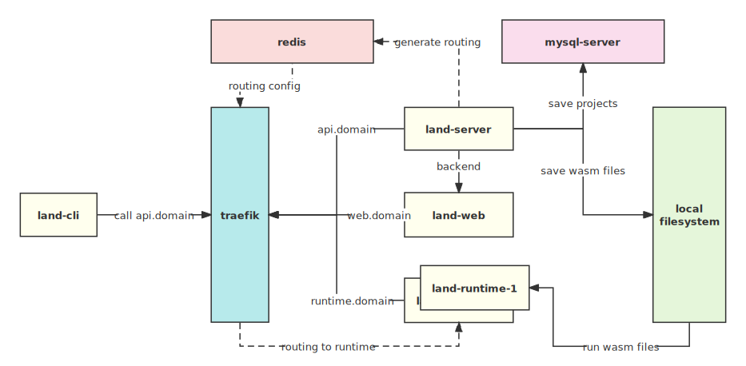

This is first develop notes of Runtime.land. Runtime.land is almost runnable in a single node. It's time to write some notes to record the development process.

## The idea

I'm building a serverless platform at a cloud computing company. It's based on Kubernetes and KubeEdge, providing functions as a service with image build and deploy. It's an awesome platform. However, WebAssembly is gaining popularity in cloud computing. I want to learn how to build a serverless platform with WebAssembly, so I start this project.

## WebAssembly Runtime

The initial step involves selecting a WebAssembly runtime. After experimenting with various options like [wasmtime](https://wasmtime.dev/), [wasmer](https://wasmer.io/), and [wasmEdge](https://wasmedge.org/), I found all of them to be exceptional projects. Ultimately, I decided to go with wasmtime due to its utilization by Fastly in their [Compute@Edge](https://www.fastly.com/products/edge-compute) solution. Additionally, my preference for Rust over C++ led me to favor wasmtime over wasmEdge, which is prominently employed by ByteDance. Rust, in my opinion, offers a more fantastic development experience.

## The Architecture

As a serverless platform, it typically requires multiple nodes to run functions efficiently. However, in the early stages of development, I have decided to run the platform on a single node using Docker Compose. This allows me to manage and orchestrate all the components easily. The architecture of the platform at this stage is simple:

- `land-server`: The API server. It's a simple HTTP server that provides API for `land-cli` and `land-web`.
- `land-web`: The dashboard site. It's a single page application that provides a dashboard for users to manage their projects.
- `land-runtime`: The runtime server. It's a HTTP server that provides a runtime for functions. It's based on wasmtime.
- `land-cli`: The command line tool. It's a command line tool that provides a CLI for users to manage their projects.
- `traefik`: The reverse proxy. It's a reverse proxy that provides a single entrypoint for all the services.
- `redis`: The cache server. It provides routing configurations for projects and `land-runtime`. So `land-runtime` can recieve the right project request.

## The JavaScript Runtime

The next significant milestone in the project is to develop JavaScript support, considering its popularity for writing functions, as seen in platforms like Cloudflare Workers and Fastly Compute@Edge. To accomplish this, I have chosen quickjs as the JavaScript runtime. [QuickJs](https://bellard.org/quickjs/) is known for being a lightweight and high-performance JavaScript engine. It seamlessly integrates with Rust projects and is readily available in the WASI environment, making it an ideal choice for my serverless platform.

## The Issue

- I currently use [PlanetScale](https://planetscale.com) for my MySQL instance, a great serverless service. However, AWS wrongly identifies my host IP as Japan instead of the US, causing slow access to the US-East MySQL instance. I might need a new node to run the entire site.
- Due to slow responses, some dashboard loading pages are missing. I'm improving the loading behavior in land-web for a smoother experience.
